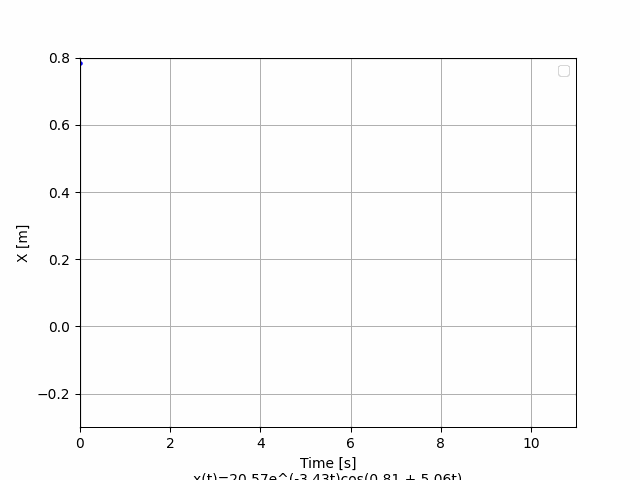

# Лабораторные работы (ЛР##) по Мат. и комп. моделированию

## [ЛР01](res/LR01.pdf) | [Решение](src/l01.ipynb)
№1
Численно решить уравнение Бесселя
$$
x^2 \frac{d^2v}{dx^2} + x \frac{dv}
{dx} + (x^2 − p^2)v = 0, \,v = v(x)
$$
удовлетворяющее начальным условиям на указанном промежутке и построить графики для
различных значений p в одном окне.

№2
Численно решить сингулярное уравнение Бесселя
$$x \frac{d^2v}{dx^2} + γ \frac{dv}
{dx} + xv = 0, v = v(x),$$
удовлетворяющее начальным условиям на указанном промежутке и построить графики для
четырех различных значений $$ \gamma \neq 0$$ в одном окне. Числа $$\gamma$$ студент выбирает 
самостоятельно.

## [ЛР02](res/LR02.pdf) | [Решение](src/l02.ipynb) | [Условие](res/LR02.pdf)

## [ЛР03](res/LR03.pdf) | [Решение](src/l03.ipynb) | [Условие](res/LR03.pdf)